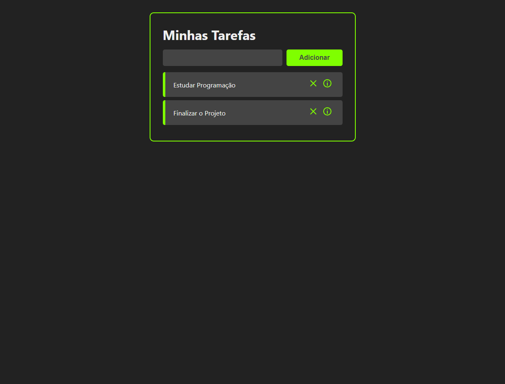

# Projeto Minhas Tarefas

Projeto introdutório de React, foi desenvolvido um sistema web de agendamentos de atividades.

## Tecnologias

- ReactJs
- HTML
- CSS
- Git e Github

[Clique aqui para acessar](https://marqueba.github.io/agendamento-atividades/)
## Contato

reis.dutra@estudante.ifro.edu.br
